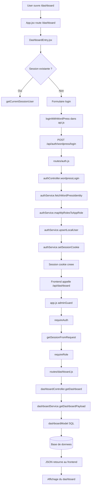

# MarsAI

Application web avec frontend React/Vite et backend Express, connectee a WordPress pour l'authentification et a MySQL pour les donnees metier.

## Architecture

- Frontend React/Vite : pages publiques, dashboard, upload, navigation, composants UI.
- Backend Express : API, auth, securite, upload, dashboard, routes metier.
- WordPress : source d'identite pour les comptes et les roles admin.
- MySQL : stockage applicatif local pour les users, films, notes, selections et statistiques.
- Crons et scripts : taches automatiques et maintenance ponctuelle cote backend.

Schema logique :

```text
Frontend -> Backend -> (WordPress + MySQL + services externes)
```

## Exemple de flux : connexion au dashboard

Cet exemple montre un parcours complet, de l'ouverture de la page jusqu'au chargement des donnees dashboard.



### Etapes

1. Le user ouvre [`/dashboard`](frontend/src/App.jsx#L80) cote frontend.
2. [`DashboardEntry.jsx`](frontend/src/pages/DashboardEntry.jsx#L14) verifie d'abord si une session existe deja avec [`getCurrentSessionUser`](frontend/src/pages/DashboardEntry.jsx#L37).
3. Si besoin, le formulaire appelle [`loginWithWordPress`](frontend/src/pages/DashboardEntry.jsx#L61), implemente dans [`api.js`](frontend/src/api.js#L617).
4. Le backend recoit la requete sur [`routes/auth.js`](backend/routes/auth.js#L12), puis passe par [`authController.js`](backend/controllers/authController.js#L16).
5. Le controleur delegue au [`authService`](backend/services/authService.js) :
   - [`mapWpRolesToAppRole`](backend/services/authService.js#L405)
   - [`fetchWordPressIdentity`](backend/services/authService.js#L436)
   - [`upsertLocalUser`](backend/services/authService.js#L737)
   - [`setSessionCookie`](backend/services/authService.js#L874)
6. Une fois la session creee, le frontend peut appeler [`/api/dashboard`](frontend/src/api.js#L824).
7. Cette route est protegee dans [`app.js`](backend/app.js#L79) et [`app.js`](backend/app.js#L89) par `requireAuth` et `requireRole`.
8. [`requireAuth`](backend/middlewares/authMiddleware.js#L3) lit le cookie avec [`getSessionFromRequest`](backend/services/authService.js#L895).
9. Si l'utilisateur est autorise, on entre dans la chaine metier :
   - route : [`routes/dashboard.js`](backend/routes/dashboard.js#L6)
   - controleur : [`dashboardController.js`](backend/controllers/dashboardController.js#L3)
   - service : [`dashboardService.js`](backend/services/dashboardService.js#L171)
   - modele SQL : [`dashboardModel.js`](backend/models/dashboardModel.js#L14)

## Ce que ce flux illustre

- une route frontend
- un appel API
- une route backend
- un middleware de securite
- un controleur
- un service metier
- un modele SQL
- puis le retour JSON vers l'interface

## Documentation complementaire

Une note technique plus detaillee est disponible dans [`README_CLIENT.md`](README_CLIENT.md).
