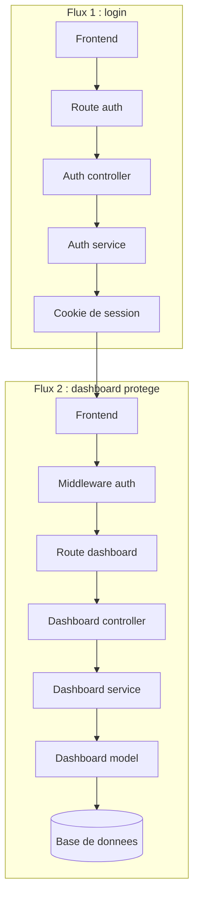

# MarsAI

Application web avec frontend React/Vite et backend Express, connectee a WordPress pour l'authentification et a MySQL pour les donnees metier.

## Demarrage du projet

### Prerequis

- Node.js 18+ (teste avec Node 22)
- Une base MySQL ou MariaDB accessible
- ffmpeg / ffprobe installes (ou definir `FFMPEG_PATH` / `FFPROBE_PATH` dans le `.env` backend)
- Un site WordPress accessible (source d'identite pour l'authentification)
- Des identifiants Scaleway Object Storage (S3) si vous testez l'upload de video

### 1. Cloner le depot

```bash
git clone https://github.com/samuel-corinthe/MarsAi.git
cd MarsAi-prod
```

### 2. Backend

```bash
cd backend
npm install
cp .env.example .env
```

Completer le `.env` avec au minimum : les identifiants de connexion a la base (`DB_HOST`, `DB_PORT`, `DB_USER`, `DB_PASSWORD`, `DB_NAME`), le port d'ecoute du serveur (`PORT`, 3000 par defaut) et les variables Scaleway/S3 deja presentes dans `.env.example`.

Creer la base de donnees puis executer les scripts SQL du dossier `backend/sql/` dans l'ordre numerique (`01_...` a `08_...`) pour mettre en place le schema.

Demarrer le serveur :

```bash
node index.js
```

Le backend demarre par defaut sur `http://localhost:3000`.

### 3. Frontend

Dans un second terminal :

```bash
cd frontend
npm install
cp .env.example .env
```

Completer le `.env` avec `VITE_WORDPRESS_URL` (l'URL de votre site WordPress) et `VITE_BACKEND_API_ORIGIN` (l'URL du backend demarre a l'etape precedente).

Demarrer le serveur de developpement :

```bash
npm run dev
```

Le frontend est alors accessible sur `http://localhost:5173`.

### 4. Verification

- `npm run test:run` (frontend) pour lancer la suite de tests Vitest.

## Architecture

- Frontend React/Vite : pages publiques, dashboard, upload, navigation, composants UI.
- Backend Express : API, auth, securite, upload, dashboard, routes metier.
- WordPress : source d'identite pour les comptes et les roles admin.
- MySQL : stockage applicatif local pour les users, films, notes, selections et statistiques.
- Crons et scripts : taches automatiques et maintenance ponctuelle cote backend.

Schema logique :

```text
Frontend -> Backend -> (WordPress + MySQL + services externes)
```

## Exemple de flux : connexion au dashboard

Cet exemple se lit en 2 temps :
- d'abord le login, qui cree la session
- ensuite l'appel au dashboard, qui passe par les middlewares de protection



### Etapes

1. Le user ouvre [`/dashboard`](frontend/src/App.jsx#L80) cote frontend.
2. [`DashboardEntry.jsx`](frontend/src/pages/DashboardEntry.jsx#L14) verifie d'abord si une session existe deja avec [`getCurrentSessionUser`](frontend/src/pages/DashboardEntry.jsx#L37).
3. Si besoin, le formulaire appelle [`loginWithWordPress`](frontend/src/pages/DashboardEntry.jsx#L61), implemente dans [`api.js`](frontend/src/api.js#L617).
4. Le backend recoit la requete sur [`routes/auth.js`](backend/routes/auth.js#L12), puis passe par [`authController.js`](backend/controllers/authController.js#L16).
5. Le controleur delegue au [`authService`](backend/services/authService.js) :
   - [`mapWpRolesToAppRole`](backend/services/authService.js#L405)
   - [`fetchWordPressIdentity`](backend/services/authService.js#L436)
   - [`upsertLocalUser`](backend/services/authService.js#L737)
   - [`setSessionCookie`](backend/services/authService.js#L874)
6. Une fois la session creee, le frontend peut appeler [`/api/dashboard`](frontend/src/api.js#L824).
7. Cette route est protegee dans [`app.js`](backend/app.js#L79) et [`app.js`](backend/app.js#L89) par `requireAuth` et `requireRole`.
8. [`requireAuth`](backend/middlewares/authMiddleware.js#L3) lit le cookie avec [`getSessionFromRequest`](backend/services/authService.js#L895).
9. Si l'utilisateur est autorise, on entre dans la chaine metier :
   - route : [`routes/dashboard.js`](backend/routes/dashboard.js#L6)
   - controleur : [`dashboardController.js`](backend/controllers/dashboardController.js#L3)
   - service : [`dashboardService.js`](backend/services/dashboardService.js#L171)
   - modele SQL : [`dashboardModel.js`](backend/models/dashboardModel.js#L14)

## Schéma global

- route frontend
- appel API
- route backend
- middleware de securite
- controleur
- service metier
- modele SQL
- retour JSON vers l'interface

## Documentation complementaire

Une note technique plus detaillee est disponible dans [`README_CLIENT.md`](README_CLIENT.md).
